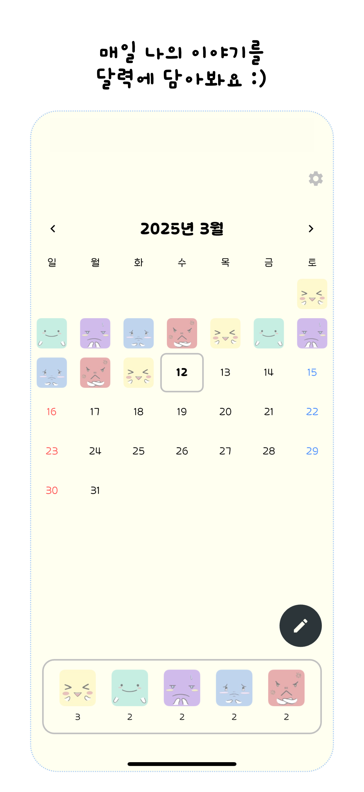
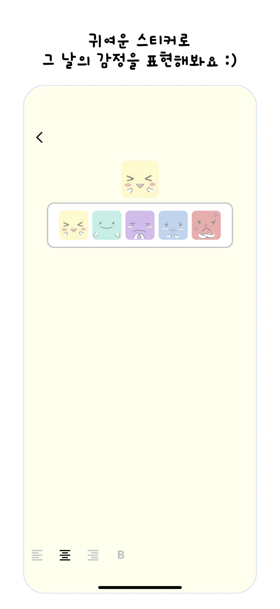
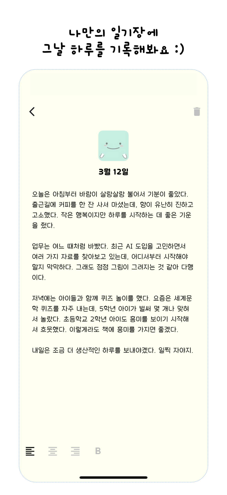
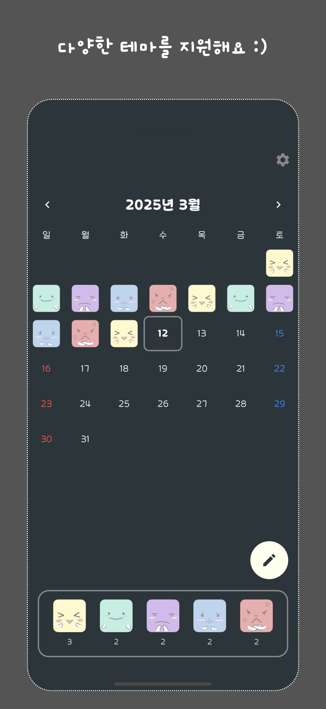
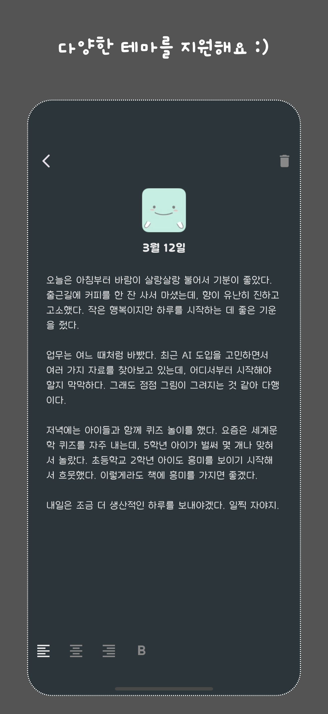
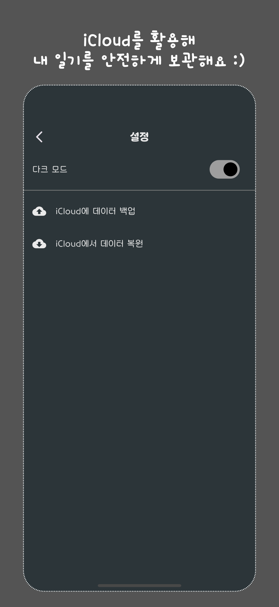

# 📝 매일일기 - 오늘을 기록하는 감성 다이어리

> **오늘의 기분과 함께 하루를 기록하는 간단한 다이어리 앱입니다.**  
> Flutter 초보 개발자들도 참고할 수 있도록 코드를 공개합니다.

---

## 🔥 지금 바로 다운로드하세요!
**App Store에서 "매일일기"를 만나보세요!**  
[🔗 App Store 다운로드](https://apps.apple.com/us/app/%EB%A7%A4%EC%9D%BC%EC%9D%BC%EA%B8%B0/id6742735505)

---

## ⭐ 프로젝트 소개

**매일일기**는 다음과 같은 기능을 제공합니다:

✅ **일기 작성**: 하루의 기록을 감성적인 UI로 남길 수 있음

✅ **기분 선택**: 기분(이모티콘)과 함께 일기 작성 가능

✅ **다크 모드 지원**: 사용자 환경에 맞춰 테마 변경 가능

✅ **로컬 데이터 저장**: SQLite 기반의 로컬 데이터베이스 활용

✅ **광고 배너 포함**: Google Mobile Ads SDK 적용

---

## 🏙️ 스크린샷 (Screenshot)

---

## 🚀 기술 스택
🔹 **Flutter** (Dart) - UI 및 로직 개발  
🔹 **Drift** (SQLite) - 로컬 데이터베이스  
🔹 **Provider** - 상태 관리  
🔹 **Google Mobile Ads** - 광고 배너  
🔹 **TableCalendar** - 캘린더 기능

---

## 📌 라이선스 (License)
이 프로젝트는 **CC BY-NC 4.0 라이선스** 하에 배포됩니다.  
✅ 개인/참고용 사용 가능  
❌ 상업적 이용 금지  
❌ 코드를 무단 배포하거나 수정하여 상업적으로 이용할 수 없음

---

## ✅ 개발 과정

- **2025.2.28** - 개발 시작, 메인 화면 디자인 및 이모티콘 이미지 제작
- **2025.3.1** - 일기 작성 페이지 디자인 및 로컬 데이터베이스 적용, 일부 기능 수정
- **2025.3.2** - 다크 모드 추가, 디자인 수정 및 광고 배너 추가
- **2025.3.3** - 로딩 화면(Splash Screen) 개발
- **2025.3.4** - 폰트 수정, 오늘 날짜 테두리 표시 적용, 현재 날짜가 속한 달로 이동할 수 있는 버튼 추가, 마이너 버그 픽스
- **2025.3.5** - 앱 아이콘 추가, 기본 뒤로가기 드래그를 통해서 데이터 저장 가능, TestFlight에 Build 업로드
- **2025.3.6** - Display Name 수정, 화면 전체에서 드래그를 통해 달 변경 가능
- **2025.3.7** - Write Screen에서 스와이프 제스처로 일기 자동 저장 및 뒤로 가기 기능 추가
- **2025.3.8** - 개인정보 추적 설정 업데이트, 애플 스토어 심사 등록
- **2025.3.10** - 애플 스토어 정식 출시
- **2025.3.11** - iCloud 백업 및 복원 기능 추가, 폰트 사이즈 조절 및 일기 작성시 화면 전체 스크롤 지원
- **2025.3.12** - 오늘 날짜의 일기 작성 버튼 추가
- **2025.3.13** - 앱 아이콘 업데이트, 1.0.1 심사 등록
- **2025.3.31** - 각 달 마지막 날짜의 감정 이모티콘이 업데이트가 되지 않는 오류 수정
- **2025.4.15** - 1.0.2 심사 등록 및 출시
- **2025.4.30** - Firebase 연동 및 1.0.3 심사 등록

---

## ⏳ 향후 개발 계획

🔹 **홈 화면 위젯 지원** (오늘의 기분 및 일기 미리보기)  

🔹 **리스트 뷰 추가** (일기 모아보기)
