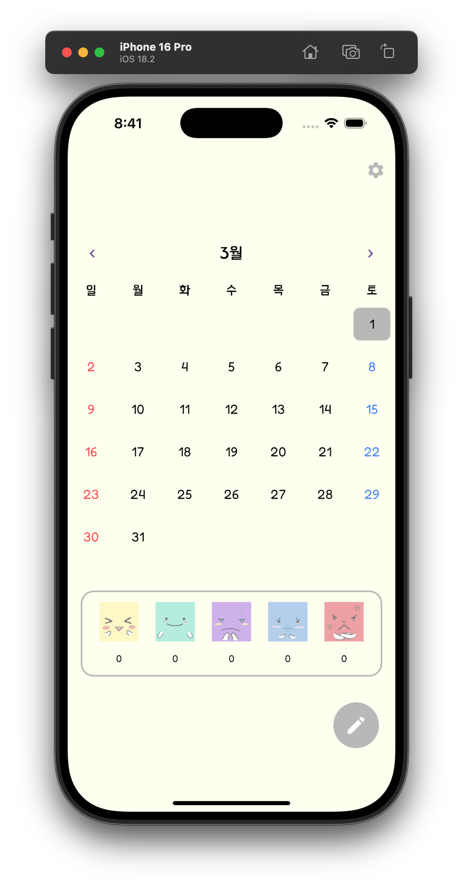
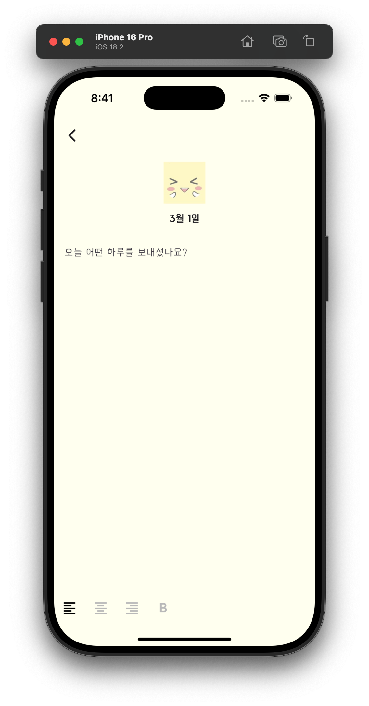

# daily_diary

오늘의 기록을 오늘의 기분과 함께 남기는 간단한 다이어리 어플입니다.

2025.2.28 - 개발 시작, 메인 화면 디자인 및 이모티콘 이미지 제작

2025.2.29 - 일기 작성 페이지 디자인

## Getting Started

This project is a starting point for a Flutter application.

A few resources to get you started if this is your first Flutter project:

- [Lab: Write your first Flutter app](https://docs.flutter.dev/get-started/codelab)
- [Cookbook: Useful Flutter samples](https://docs.flutter.dev/cookbook)

For help getting started with Flutter development, view the
[online documentation](https://docs.flutter.dev/), which offers tutorials,
samples, guidance on mobile development, and a full API reference.
